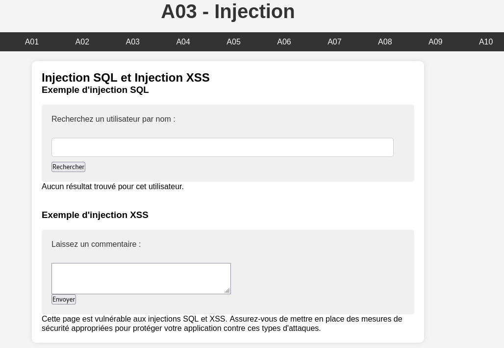

<h1 align="center">
    <br>
        🕵️‍♂️💻 VulnerableApp - PHP App pour le Top 10 OWASP 2021
    <br>
    <br>
</h1>

VulnerableApp est une application PHP simple conçue pour illustrer les dix principales vulnérabilités de sécurité selon l'OWASP 2021.

## Description 📝

VulnerableApp est un outil pédagogique qui aide à identifier et comprendre les vulnérabilités de sécurité courantes répertoriées dans le Top Ten OWASP 2021. Il offre un environnement pratique pour tester et apprendre comment ces vulnérabilités peuvent être exploitées et atténuées.

## Fonctionnalités ⚙️

- Démontre chacune des dix premières vulnérabilités de l'OWASP 2021
- Facile à utiliser avec une interface simple
- Fournit des exemples de défauts de sécurité courants et comment ils peuvent être exploités

## Utilisation 🚀

1. Clonez le dépôt :

```bash
git clone https://github.com/yourusername/VulnerableApp.git
```

2. Accédez au répertoire VulnerableApp :
    
    ```bash
    cd VulnerableApp
    ```
3. Lancez le setup.sh pour lancer l'infrastructure :

    ```bash
    ./setup.sh
    ```

4. Accédez à l'application dans votre navigateur à l'adresse suivante :

    ```bash
    http://localhost:8042
    ```

## Avertissement ⚠️

Cet outil est destiné à des fins éducatives uniquement. L'utilisation abusive de cet outil sur des sites web sans autorisation préalable est illégale et peut entraîner des conséquences juridiques.

## Contribuer 🤝

Les contributions sont les bienvenues ! N'hésitez pas à ouvrir une issue ou à soumettre une demande.

